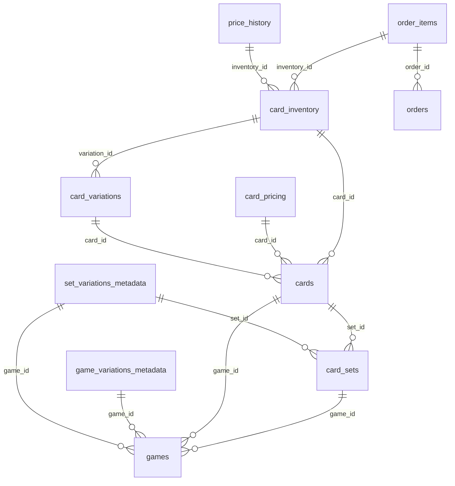

# Database Schema Documentation

**Generated:** 2025-10-14T07:57:10.709Z
**Database:** PostgreSQL (production)

This document provides a comprehensive overview of the database structure, including tables, relationships, indexes, and sample data.

## Table of Contents

1. [Database Overview](#database-overview)
2. [Tables](#tables)
   3. [audit_log](#audit-log)
   4. [card_inventory](#card-inventory)
   5. [card_pricing](#card-pricing)
   6. [card_sets](#card-sets)
   7. [card_variations](#card-variations)
   8. [cards](#cards)
   9. [game_variations_metadata](#game-variations-metadata)
   10. [games](#games)
   11. [order_items](#order-items)
   12. [orders](#orders)
   13. [price_history](#price-history)
   14. [set_variations_metadata](#set-variations-metadata)
15. [Views](#views)
16. [Materialized Views](#materialized-views)
17. [Relationships Diagram](#relationships-diagram)

## Database Overview

| Table | Row Count |
|-------|-----------|
| card_sets | 6 |
| set_variations_metadata | 4 |
| games | 2 |
| audit_log | 0 |
| card_inventory | 0 |
| card_pricing | 0 |
| card_variations | 0 |
| cards | 0 |
| game_variations_metadata | 0 |
| order_items | 0 |
| orders | 0 |
| price_history | 0 |

**Total Records:** 12

## Tables


### audit_log

**Row Count:** 0

**Columns:**

| Column | Type | Nullable | Default |
|--------|------|----------|----------|
| id | integer | ✗ | nextval('audit_log_id_seq'::regclass) |
| user_id | integer | ✓ | - |
| action | character varying(50) | ✗ | - |
| table_name | character varying(50) | ✗ | - |
| record_id | integer | ✓ | - |
| old_value | jsonb | ✓ | - |
| new_value | jsonb | ✓ | - |
| created_at | timestamp without time zone | ✓ | now() |


**Constraints:**

**CHECK:**
- `2200_16773_1_not_null`: multiple columns
- `2200_16773_3_not_null`: multiple columns
- `2200_16773_4_not_null`: multiple columns

**PRIMARY KEY:**
- `audit_log_pkey`: id


**Indexes:**

```sql
CREATE UNIQUE INDEX audit_log_pkey ON public.audit_log USING btree (id)
```

---


### card_inventory

**Row Count:** 0

**Columns:**

| Column | Type | Nullable | Default |
|--------|------|----------|----------|
| id | integer | ✗ | nextval('card_inventory_id_seq'::regclass) |
| card_id | integer | ✓ | - |
| variation_id | integer | ✓ | - |
| quality | character varying(50) | ✗ | - |
| stock_quantity | integer | ✗ | 0 |
| price | numeric | ✗ | - |
| price_source | character varying(50) | ✓ | - |
| last_price_update | timestamp without time zone | ✓ | - |
| sku | character varying(100) | ✓ | - |
| created_at | timestamp without time zone | ✓ | CURRENT_TIMESTAMP |
| updated_at | timestamp without time zone | ✓ | CURRENT_TIMESTAMP |
| foil_type | character varying(50) | ✓ | 'Regular'::character varying |
| language | character varying(50) | ✓ | 'English'::character varying |
| cost | numeric | ✓ | - |
| markup_percentage | numeric | ✗ | 0 |
| auto_price_enabled | boolean | ✗ | false |
| low_stock_threshold | integer | ✗ | 3 |
| tcgplayer_id | character varying(255) | ✓ | - |


**Constraints:**

**CHECK:**
- `2200_16554_15_not_null`: multiple columns
- `2200_16554_16_not_null`: multiple columns
- `2200_16554_17_not_null`: multiple columns
- `2200_16554_1_not_null`: multiple columns
- `2200_16554_4_not_null`: multiple columns
- `2200_16554_5_not_null`: multiple columns
- `2200_16554_6_not_null`: multiple columns
- `chk_foil_type_nonempty`: multiple columns
- `chk_language_nonempty`: multiple columns
- `chk_price_nonneg`: multiple columns
- `chk_quality_nonempty`: multiple columns
- `chk_stock_nonneg`: multiple columns

**FOREIGN KEY:**
- `card_inventory_card_id_fkey`: card_id → cards(id)
- `card_inventory_variation_id_fkey`: variation_id → card_variations(id)

**PRIMARY KEY:**
- `card_inventory_pkey`: id

**UNIQUE:**
- `card_inventory_card_id_variation_id_quality_key`: variation_id
- `card_inventory_card_id_variation_id_quality_key`: card_id
- `card_inventory_card_id_variation_id_quality_key`: card_id
- `card_inventory_card_id_variation_id_quality_key`: card_id
- `card_inventory_card_id_variation_id_quality_key`: variation_id
- `card_inventory_card_id_variation_id_quality_key`: variation_id
- `card_inventory_card_id_variation_id_quality_key`: quality
- `card_inventory_card_id_variation_id_quality_key`: quality
- `card_inventory_card_id_variation_id_quality_key`: quality
- `card_inventory_sku_key`: sku
- `card_inventory_unique_card_variation_quality_foil_lang`: quality
- `card_inventory_unique_card_variation_quality_foil_lang`: quality
- `card_inventory_unique_card_variation_quality_foil_lang`: foil_type
- `card_inventory_unique_card_variation_quality_foil_lang`: foil_type
- `card_inventory_unique_card_variation_quality_foil_lang`: foil_type
- `card_inventory_unique_card_variation_quality_foil_lang`: foil_type
- `card_inventory_unique_card_variation_quality_foil_lang`: foil_type
- `card_inventory_unique_card_variation_quality_foil_lang`: language
- `card_inventory_unique_card_variation_quality_foil_lang`: language
- `card_inventory_unique_card_variation_quality_foil_lang`: language
- `card_inventory_unique_card_variation_quality_foil_lang`: language
- `card_inventory_unique_card_variation_quality_foil_lang`: language
- `card_inventory_unique_card_variation_quality_foil_lang`: quality
- `card_inventory_unique_card_variation_quality_foil_lang`: quality
- `card_inventory_unique_card_variation_quality_foil_lang`: variation_id
- `card_inventory_unique_card_variation_quality_foil_lang`: variation_id
- `card_inventory_unique_card_variation_quality_foil_lang`: variation_id
- `card_inventory_unique_card_variation_quality_foil_lang`: variation_id
- `card_inventory_unique_card_variation_quality_foil_lang`: variation_id
- `card_inventory_unique_card_variation_quality_foil_lang`: card_id
- `card_inventory_unique_card_variation_quality_foil_lang`: card_id
- `card_inventory_unique_card_variation_quality_foil_lang`: card_id
- `card_inventory_unique_card_variation_quality_foil_lang`: card_id
- `card_inventory_unique_card_variation_quality_foil_lang`: card_id
- `card_inventory_unique_card_variation_quality_foil_lang`: quality


**Indexes:**

```sql
CREATE UNIQUE INDEX card_inventory_card_id_variation_id_quality_key ON public.card_inventory USING btree (card_id, variation_id, quality)
```

```sql
CREATE UNIQUE INDEX card_inventory_pkey ON public.card_inventory USING btree (id)
```

```sql
CREATE UNIQUE INDEX card_inventory_sku_key ON public.card_inventory USING btree (sku)
```

```sql
CREATE UNIQUE INDEX card_inventory_unique_card_variation_quality_foil_lang ON public.card_inventory USING btree (card_id, variation_id, quality, foil_type, language)
```

```sql
CREATE INDEX idx_inventory_card ON public.card_inventory USING btree (card_id)
```

```sql
CREATE INDEX idx_inventory_card_quality ON public.card_inventory USING btree (card_id, quality)
```

```sql
CREATE INDEX idx_inventory_card_variation ON public.card_inventory USING btree (card_id, variation_id)
```

```sql
CREATE INDEX idx_inventory_filters ON public.card_inventory USING btree (quality, foil_type, language)
```

```sql
CREATE INDEX idx_inventory_price ON public.card_inventory USING btree (price)
```

```sql
CREATE INDEX idx_inventory_price_stock ON public.card_inventory USING btree (price, stock_quantity) WHERE (stock_quantity > 0)
```

```sql
CREATE INDEX idx_inventory_quality ON public.card_inventory USING btree (quality)
```

```sql
CREATE INDEX idx_inventory_search ON public.card_inventory USING btree (card_id, stock_quantity) WHERE (stock_quantity > 0)
```

```sql
CREATE INDEX idx_inventory_stock ON public.card_inventory USING btree (stock_quantity)
```

```sql
CREATE INDEX idx_inventory_stock_price ON public.card_inventory USING btree (stock_quantity, price) WHERE (stock_quantity > 0)
```

```sql
CREATE INDEX idx_inventory_updated ON public.card_inventory USING btree (updated_at DESC)
```

---


### card_pricing

**Row Count:** 0

**Columns:**

| Column | Type | Nullable | Default |
|--------|------|----------|----------|
| id | integer | ✗ | nextval('card_pricing_id_seq'::regclass) |
| card_id | integer | ✗ | - |
| base_price | numeric | ✗ | 0 |
| foil_price | numeric | ✗ | 0 |
| price_source | character varying(50) | ✓ | 'manual'::character varying |
| updated_at | timestamp without time zone | ✓ | CURRENT_TIMESTAMP |
| created_at | timestamp without time zone | ✓ | CURRENT_TIMESTAMP |


**Constraints:**

**CHECK:**
- `2200_16826_1_not_null`: multiple columns
- `2200_16826_2_not_null`: multiple columns
- `2200_16826_3_not_null`: multiple columns
- `2200_16826_4_not_null`: multiple columns

**FOREIGN KEY:**
- `card_pricing_card_id_fkey`: card_id → cards(id)

**UNIQUE:**
- `card_pricing_card_id_key`: card_id


**Indexes:**

```sql
CREATE UNIQUE INDEX card_pricing_card_id_key ON public.card_pricing USING btree (card_id)
```

```sql
CREATE INDEX idx_card_pricing_card_id ON public.card_pricing USING btree (card_id)
```

```sql
CREATE INDEX idx_card_pricing_source ON public.card_pricing USING btree (price_source)
```

```sql
CREATE INDEX idx_card_pricing_updated ON public.card_pricing USING btree (updated_at DESC)
```

---


### card_sets

**Row Count:** 6

**Columns:**

| Column | Type | Nullable | Default |
|--------|------|----------|----------|
| id | integer | ✗ | nextval('card_sets_id_seq'::regclass) |
| game_id | integer | ✓ | - |
| name | character varying(255) | ✗ | - |
| code | character varying(50) | ✗ | - |
| release_date | date | ✓ | - |
| active | boolean | ✓ | true |
| created_at | timestamp without time zone | ✓ | CURRENT_TIMESTAMP |
| updated_at | timestamp without time zone | ✓ | CURRENT_TIMESTAMP |


**Constraints:**

**CHECK:**
- `2200_16499_1_not_null`: multiple columns
- `2200_16499_3_not_null`: multiple columns
- `2200_16499_4_not_null`: multiple columns

**FOREIGN KEY:**
- `card_sets_game_id_fkey`: game_id → games(id)

**PRIMARY KEY:**
- `card_sets_pkey`: id

**UNIQUE:**
- `card_sets_game_id_code_key`: game_id
- `card_sets_game_id_code_key`: code
- `card_sets_game_id_code_key`: code
- `card_sets_game_id_code_key`: game_id


**Indexes:**

```sql
CREATE UNIQUE INDEX card_sets_game_id_code_key ON public.card_sets USING btree (game_id, code)
```

```sql
CREATE UNIQUE INDEX card_sets_pkey ON public.card_sets USING btree (id)
```

```sql
CREATE INDEX idx_card_sets_name_trgm ON public.card_sets USING gin (name gin_trgm_ops)
```

**Sample Data:**

```json
[
  {
    "id": 1,
    "game_id": 1,
    "name": "Bloomburrow",
    "code": "BLB",
    "release_date": "2024-08-01T12:00:00.000Z",
    "active": true,
    "created_at": "2025-10-06T08:50:06.868Z",
    "updated_at": "2025-10-06T08:50:06.868Z"
  },
  {
    "id": 2,
    "game_id": 1,
    "name": "Modern Horizons 3",
    "code": "MH3",
    "release_date": "2024-06-13T12:00:00.000Z",
    "active": true,
    "created_at": "2025-10-06T08:50:06.868Z",
    "updated_at": "2025-10-06T08:50:06.868Z"
  },
  {
    "id": 3,
    "game_id": 2,
    "name": "Scarlet & Violet",
    "code": "SVI",
    "release_date": "2023-03-30T11:00:00.000Z",
    "active": true,
    "created_at": "2025-10-06T08:50:06.868Z",
    "updated_at": "2025-10-06T08:50:06.868Z"
  }
]
```

---


### card_variations

**Row Count:** 0

**Columns:**

| Column | Type | Nullable | Default |
|--------|------|----------|----------|
| id | integer | ✗ | nextval('card_variations_id_seq'::regclass) |
| card_id | integer | ✓ | - |
| variation_name | character varying(255) | ✗ | - |
| variation_code | character varying(50) | ✓ | - |
| image_url | text | ✓ | - |
| created_at | timestamp without time zone | ✓ | CURRENT_TIMESTAMP |


**Constraints:**

**CHECK:**
- `2200_16539_1_not_null`: multiple columns
- `2200_16539_3_not_null`: multiple columns

**FOREIGN KEY:**
- `card_variations_card_id_fkey`: card_id → cards(id)

**PRIMARY KEY:**
- `card_variations_pkey`: id


**Indexes:**

```sql
CREATE UNIQUE INDEX card_variations_pkey ON public.card_variations USING btree (id)
```

---


### cards

**Row Count:** 0

**Columns:**

| Column | Type | Nullable | Default |
|--------|------|----------|----------|
| id | integer | ✗ | nextval('cards_id_seq'::regclass) |
| game_id | integer | ✓ | - |
| set_id | integer | ✓ | - |
| name | character varying(255) | ✗ | - |
| card_number | character varying(50) | ✗ | - |
| rarity | character varying(100) | ✓ | - |
| card_type | character varying(100) | ✓ | - |
| description | text | ✓ | - |
| image_url | text | ✓ | - |
| scryfall_id | character varying(255) | ✓ | - |
| tcgplayer_id | integer | ✓ | - |
| pokemontcg_id | character varying(255) | ✓ | - |
| created_at | timestamp without time zone | ✓ | CURRENT_TIMESTAMP |
| updated_at | timestamp without time zone | ✓ | CURRENT_TIMESTAMP |
| search_tsv | tsvector | ✓ | - |
| border_color | character varying(20) | ✓ | - |
| finish | character varying(20) | ✓ | - |
| frame_effect | character varying(100) | ✓ | - |
| promo_type | character varying(50) | ✓ | - |
| treatment | character varying(100) | ✓ | - |
| sku | character varying(100) | ✓ | - |


**Constraints:**

**CHECK:**
- `2200_16516_1_not_null`: multiple columns
- `2200_16516_4_not_null`: multiple columns
- `2200_16516_5_not_null`: multiple columns

**FOREIGN KEY:**
- `cards_game_id_fkey`: game_id → games(id)
- `cards_set_id_fkey`: set_id → card_sets(id)

**PRIMARY KEY:**
- `cards_pkey`: id

**UNIQUE:**
- `cards_set_id_card_number_key`: card_number
- `cards_set_id_card_number_key`: card_number
- `cards_set_id_card_number_key`: set_id
- `cards_set_id_card_number_key`: set_id
- `cards_sku_key`: sku


**Indexes:**

```sql
CREATE UNIQUE INDEX cards_pkey ON public.cards USING btree (id)
```

```sql
CREATE UNIQUE INDEX cards_set_id_card_number_key ON public.cards USING btree (set_id, card_number)
```

```sql
CREATE UNIQUE INDEX cards_sku_key ON public.cards USING btree (sku)
```

```sql
CREATE INDEX idx_cards_border_color ON public.cards USING btree (border_color)
```

```sql
CREATE INDEX idx_cards_card_type ON public.cards USING btree (card_type)
```

```sql
CREATE INDEX idx_cards_finish ON public.cards USING btree (finish)
```

```sql
CREATE INDEX idx_cards_game_name ON public.cards USING btree (game_id, name)
```

```sql
CREATE INDEX idx_cards_game_set ON public.cards USING btree (game_id, set_id)
```

```sql
CREATE INDEX idx_cards_game_treatment ON public.cards USING btree (game_id, treatment)
```

```sql
CREATE INDEX idx_cards_name ON public.cards USING btree (name)
```

```sql
CREATE INDEX idx_cards_name_trgm ON public.cards USING gin (name gin_trgm_ops)
```

```sql
CREATE INDEX idx_cards_number_trgm ON public.cards USING gin (card_number gin_trgm_ops)
```

```sql
CREATE INDEX idx_cards_promo_type ON public.cards USING btree (promo_type)
```

```sql
CREATE INDEX idx_cards_rarity ON public.cards USING btree (rarity)
```

```sql
CREATE INDEX idx_cards_search_tsv ON public.cards USING gin (to_tsvector('english'::regconfig, (((((name)::text || ' '::text) || (COALESCE(card_type, ''::character varying))::text) || ' '::text) || COALESCE(description, ''::text))))
```

```sql
CREATE INDEX idx_cards_search_tsv_column ON public.cards USING gin (search_tsv)
```

```sql
CREATE INDEX idx_cards_set_name ON public.cards USING btree (set_id, name)
```

```sql
CREATE INDEX idx_cards_set_treatment ON public.cards USING btree (set_id, treatment)
```

```sql
CREATE INDEX idx_cards_sku ON public.cards USING btree (sku)
```

```sql
CREATE INDEX idx_cards_treatment ON public.cards USING btree (treatment)
```

---


### game_variations_metadata

**Row Count:** 0

**Columns:**

| Column | Type | Nullable | Default |
|--------|------|----------|----------|
| id | integer | ✗ | nextval('game_variations_metadata_id_seq'::regclass) |
| game_id | integer | ✗ | - |
| visual_treatments | jsonb | ✓ | '[]'::jsonb |
| special_foils | jsonb | ✓ | '[]'::jsonb |
| border_colors | jsonb | ✓ | '[]'::jsonb |
| frame_effects | jsonb | ✓ | '[]'::jsonb |
| treatment_codes | jsonb | ✓ | '[]'::jsonb |
| total_sets | integer | ✓ | 0 |
| total_cards | integer | ✓ | 0 |
| total_variations | integer | ✓ | 0 |
| last_analyzed | timestamp without time zone | ✓ | now() |
| created_at | timestamp without time zone | ✓ | now() |
| updated_at | timestamp without time zone | ✓ | now() |


**Constraints:**

**CHECK:**
- `2200_16892_1_not_null`: multiple columns
- `2200_16892_2_not_null`: multiple columns

**FOREIGN KEY:**
- `game_variations_metadata_game_id_fkey`: game_id → games(id)

**PRIMARY KEY:**
- `game_variations_metadata_pkey`: id

**UNIQUE:**
- `game_variations_metadata_game_id_key`: game_id


**Indexes:**

```sql
CREATE UNIQUE INDEX game_variations_metadata_game_id_key ON public.game_variations_metadata USING btree (game_id)
```

```sql
CREATE UNIQUE INDEX game_variations_metadata_pkey ON public.game_variations_metadata USING btree (id)
```

```sql
CREATE INDEX idx_game_variations_game ON public.game_variations_metadata USING btree (game_id)
```

```sql
CREATE INDEX idx_game_variations_treatments ON public.game_variations_metadata USING gin (treatment_codes)
```

---


### games

**Row Count:** 2

**Columns:**

| Column | Type | Nullable | Default |
|--------|------|----------|----------|
| id | integer | ✗ | nextval('games_id_seq'::regclass) |
| name | character varying(255) | ✗ | - |
| code | character varying(50) | ✗ | - |
| active | boolean | ✓ | true |
| created_at | timestamp without time zone | ✓ | CURRENT_TIMESTAMP |
| updated_at | timestamp without time zone | ✓ | CURRENT_TIMESTAMP |


**Constraints:**

**CHECK:**
- `2200_16485_1_not_null`: multiple columns
- `2200_16485_2_not_null`: multiple columns
- `2200_16485_3_not_null`: multiple columns

**PRIMARY KEY:**
- `games_pkey`: id

**UNIQUE:**
- `games_code_key`: code
- `games_name_key`: name


**Indexes:**

```sql
CREATE UNIQUE INDEX games_code_key ON public.games USING btree (code)
```

```sql
CREATE UNIQUE INDEX games_name_key ON public.games USING btree (name)
```

```sql
CREATE UNIQUE INDEX games_pkey ON public.games USING btree (id)
```

**Sample Data:**

```json
[
  {
    "id": 1,
    "name": "Magic: The Gathering",
    "code": "mtg",
    "active": true,
    "created_at": "2025-10-06T08:49:41.071Z",
    "updated_at": "2025-10-06T08:49:41.071Z"
  },
  {
    "id": 2,
    "name": "Pokemon",
    "code": "pokemon",
    "active": true,
    "created_at": "2025-10-06T08:49:41.071Z",
    "updated_at": "2025-10-06T08:49:41.071Z"
  }
]
```

---


### order_items

**Row Count:** 0

**Columns:**

| Column | Type | Nullable | Default |
|--------|------|----------|----------|
| id | integer | ✗ | nextval('order_items_id_seq'::regclass) |
| order_id | integer | ✓ | - |
| inventory_id | integer | ✓ | - |
| card_name | character varying(255) | ✗ | - |
| quality | character varying(50) | ✗ | - |
| quantity | integer | ✗ | - |
| unit_price | numeric | ✗ | - |
| total_price | numeric | ✗ | - |
| created_at | timestamp without time zone | ✓ | CURRENT_TIMESTAMP |


**Constraints:**

**CHECK:**
- `2200_16592_1_not_null`: multiple columns
- `2200_16592_4_not_null`: multiple columns
- `2200_16592_5_not_null`: multiple columns
- `2200_16592_6_not_null`: multiple columns
- `2200_16592_7_not_null`: multiple columns
- `2200_16592_8_not_null`: multiple columns
- `chk_quantity_positive`: multiple columns
- `chk_total_price_nonneg`: multiple columns
- `chk_unit_price_nonneg`: multiple columns

**FOREIGN KEY:**
- `order_items_inventory_id_fkey`: inventory_id → card_inventory(id)
- `order_items_order_id_fkey`: order_id → orders(id)

**PRIMARY KEY:**
- `order_items_pkey`: id


**Indexes:**

```sql
CREATE UNIQUE INDEX order_items_pkey ON public.order_items USING btree (id)
```

---


### orders

**Row Count:** 0

**Columns:**

| Column | Type | Nullable | Default |
|--------|------|----------|----------|
| id | integer | ✗ | nextval('orders_id_seq'::regclass) |
| customer_email | character varying(255) | ✗ | - |
| customer_name | character varying(255) | ✓ | - |
| subtotal | numeric | ✗ | - |
| tax | numeric | ✓ | 0 |
| shipping | numeric | ✓ | 0 |
| total | numeric | ✗ | - |
| status | character varying(50) | ✓ | 'pending'::character varying |
| payment_intent_id | character varying(255) | ✓ | - |
| created_at | timestamp without time zone | ✓ | CURRENT_TIMESTAMP |
| updated_at | timestamp without time zone | ✓ | CURRENT_TIMESTAMP |


**Constraints:**

**CHECK:**
- `2200_16456_1_not_null`: multiple columns
- `2200_16456_2_not_null`: multiple columns
- `2200_16456_4_not_null`: multiple columns
- `2200_16456_7_not_null`: multiple columns
- `chk_shipping_nonneg`: multiple columns
- `chk_subtotal_nonneg`: multiple columns
- `chk_tax_nonneg`: multiple columns
- `chk_total_nonneg`: multiple columns

**PRIMARY KEY:**
- `orders_pkey`: id


**Indexes:**

```sql
CREATE INDEX idx_orders_created ON public.orders USING btree (created_at)
```

```sql
CREATE INDEX idx_orders_status ON public.orders USING btree (status)
```

```sql
CREATE UNIQUE INDEX orders_pkey ON public.orders USING btree (id)
```

---


### price_history

**Row Count:** 0

**Columns:**

| Column | Type | Nullable | Default |
|--------|------|----------|----------|
| id | integer | ✗ | nextval('price_history_id_seq'::regclass) |
| inventory_id | integer | ✓ | - |
| price | numeric | ✗ | - |
| source | character varying(50) | ✓ | - |
| recorded_at | timestamp without time zone | ✓ | CURRENT_TIMESTAMP |


**Constraints:**

**CHECK:**
- `2200_16578_1_not_null`: multiple columns
- `2200_16578_3_not_null`: multiple columns

**FOREIGN KEY:**
- `price_history_inventory_id_fkey`: inventory_id → card_inventory(id)

**PRIMARY KEY:**
- `price_history_pkey`: id


**Indexes:**

```sql
CREATE INDEX idx_price_history_inventory ON public.price_history USING btree (inventory_id)
```

```sql
CREATE INDEX idx_price_history_recorded ON public.price_history USING btree (recorded_at DESC)
```

```sql
CREATE UNIQUE INDEX price_history_pkey ON public.price_history USING btree (id)
```

---


### set_variations_metadata

**Row Count:** 4

**Columns:**

| Column | Type | Nullable | Default |
|--------|------|----------|----------|
| id | integer | ✗ | nextval('set_variations_metadata_id_seq'::regclass) |
| set_id | integer | ✗ | - |
| game_id | integer | ✗ | - |
| visual_treatments | jsonb | ✓ | '[]'::jsonb |
| special_foils | jsonb | ✓ | '[]'::jsonb |
| border_colors | jsonb | ✓ | '[]'::jsonb |
| frame_effects | jsonb | ✓ | '[]'::jsonb |
| treatment_codes | jsonb | ✓ | '[]'::jsonb |
| total_cards | integer | ✓ | 0 |
| total_variations | integer | ✓ | 0 |
| last_analyzed | timestamp without time zone | ✓ | now() |
| created_at | timestamp without time zone | ✓ | now() |
| updated_at | timestamp without time zone | ✓ | now() |


**Constraints:**

**CHECK:**
- `2200_16856_1_not_null`: multiple columns
- `2200_16856_2_not_null`: multiple columns
- `2200_16856_3_not_null`: multiple columns

**FOREIGN KEY:**
- `set_variations_metadata_game_id_fkey`: game_id → games(id)
- `set_variations_metadata_set_id_fkey`: set_id → card_sets(id)

**PRIMARY KEY:**
- `set_variations_metadata_pkey`: id

**UNIQUE:**
- `set_variations_metadata_set_id_game_id_key`: set_id
- `set_variations_metadata_set_id_game_id_key`: game_id
- `set_variations_metadata_set_id_game_id_key`: game_id
- `set_variations_metadata_set_id_game_id_key`: set_id


**Indexes:**

```sql
CREATE INDEX idx_set_variations_foils ON public.set_variations_metadata USING gin (special_foils)
```

```sql
CREATE INDEX idx_set_variations_game ON public.set_variations_metadata USING btree (game_id)
```

```sql
CREATE INDEX idx_set_variations_set ON public.set_variations_metadata USING btree (set_id)
```

```sql
CREATE INDEX idx_set_variations_treatments ON public.set_variations_metadata USING gin (treatment_codes)
```

```sql
CREATE INDEX idx_set_variations_visual ON public.set_variations_metadata USING gin (visual_treatments)
```

```sql
CREATE UNIQUE INDEX set_variations_metadata_pkey ON public.set_variations_metadata USING btree (id)
```

```sql
CREATE UNIQUE INDEX set_variations_metadata_set_id_game_id_key ON public.set_variations_metadata USING btree (set_id, game_id)
```

**Sample Data:**

```json
[
  {
    "id": 1667,
    "set_id": 7,
    "game_id": 1,
    "visual_treatments": [],
    "special_foils": [],
    "border_colors": [],
    "frame_effects": [],
    "treatment_codes": [],
    "total_cards": 0,
    "total_variations": 0,
    "last_analyzed": "2025-10-13T15:18:27.997Z",
    "created_at": "2025-10-13T15:18:27.997Z",
    "updated_at": "2025-10-13T15:18:27.997Z"
  },
  {
    "id": 1676,
    "set_id": 4,
    "game_id": 2,
    "visual_treatments": [],
    "special_foils": [],
    "border_colors": [],
    "frame_effects": [],
    "treatment_codes": [],
    "total_cards": 0,
    "total_variations": 0,
    "last_analyzed": "2025-10-13T15:18:27.997Z",
    "created_at": "2025-10-13T15:18:27.997Z",
    "updated_at": "2025-10-13T15:18:27.997Z"
  },
  {
    "id": 1738,
    "set_id": 8,
    "game_id": 2,
    "visual_treatments": [],
    "special_foils": [],
    "border_colors": [],
    "frame_effects": [],
    "treatment_codes": [],
    "total_cards": 0,
    "total_variations": 0,
    "last_analyzed": "2025-10-13T15:18:27.997Z",
    "created_at": "2025-10-13T15:18:27.997Z",
    "updated_at": "2025-10-13T15:18:27.997Z"
  }
]
```

---


## Views


### v_game_variations

```sql
 SELECT g.id AS game_id,
    g.code AS game_code,
    g.name AS game_name,
    c.treatment,
    c.border_color,
    c.finish,
    c.promo_type,
    c.frame_effect,
    count(DISTINCT c.set_id) AS set_count,
    count(*) AS count
   FROM (games g
     JOIN cards c ON ((c.game_id = g.id)))
  GROUP BY g.id, g.code, g.name, c.treatment, c.border_color, c.finish, c.promo_type, c.frame_effect;
```


### v_set_variations

```sql
 SELECT cs.id AS set_id,
    cs.code AS set_code,
    cs.name AS set_name,
    g.id AS game_id,
    g.code AS game_code,
    c.treatment,
    c.border_color,
    c.finish,
    c.promo_type,
    c.frame_effect,
    count(*) AS count
   FROM ((card_sets cs
     JOIN games g ON ((g.id = cs.game_id)))
     JOIN cards c ON ((c.set_id = cs.id)))
  WHERE (cs.active = true)
  GROUP BY cs.id, cs.code, cs.name, g.id, g.code, c.treatment, c.border_color, c.finish, c.promo_type, c.frame_effect;
```


## Materialized Views


### mv_set_variation_filters

```sql
 SELECT cs.id AS set_id,
    cs.code AS set_code,
    cs.name AS set_name,
    g.id AS game_id,
    g.name AS game_name,
    array_agg(DISTINCT c.treatment) FILTER (WHERE (c.treatment IS NOT NULL)) AS treatments,
    array_agg(DISTINCT c.border_color) FILTER (WHERE (c.border_color IS NOT NULL)) AS border_colors,
    array_agg(DISTINCT c.finish) FILTER (WHERE (c.finish IS NOT NULL)) AS finishes,
    array_agg(DISTINCT c.promo_type) FILTER (WHERE (c.promo_type IS NOT NULL)) AS promo_types,
    array_agg(DISTINCT c.frame_effect) FILTER (WHERE (c.frame_effect IS NOT NULL)) AS frame_effects,
    count(DISTINCT c.id) AS card_count,
    count(c.id) AS variation_count
   FROM ((card_sets cs
     JOIN games g ON ((g.id = cs.game_id)))
     LEFT JOIN cards c ON ((c.set_id = cs.id)))
  WHERE (cs.active = true)
  GROUP BY cs.id, cs.code, cs.name, g.id, g.name;
```


## Relationships Diagram


